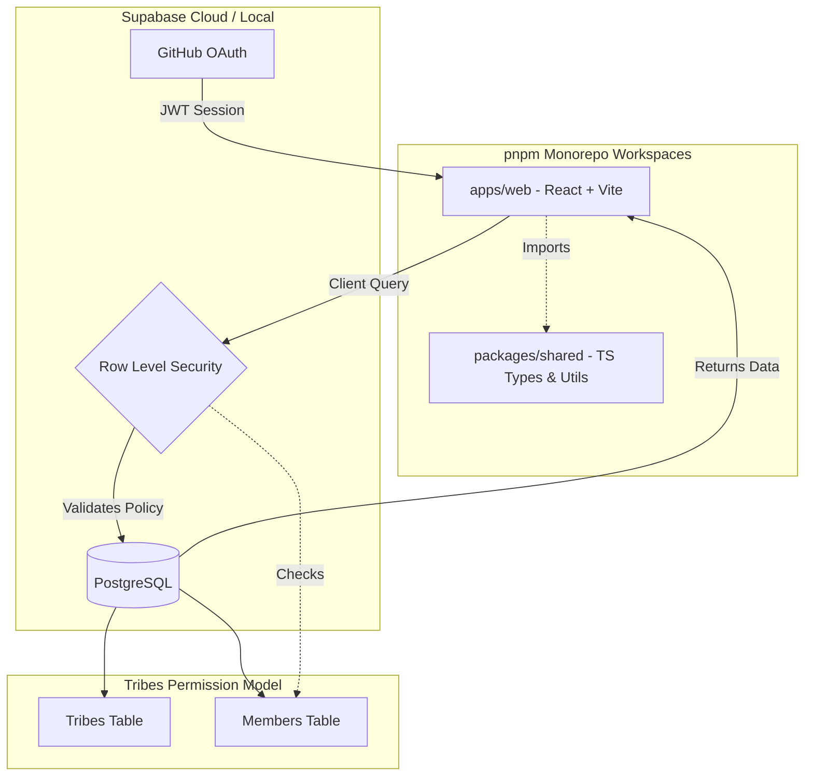
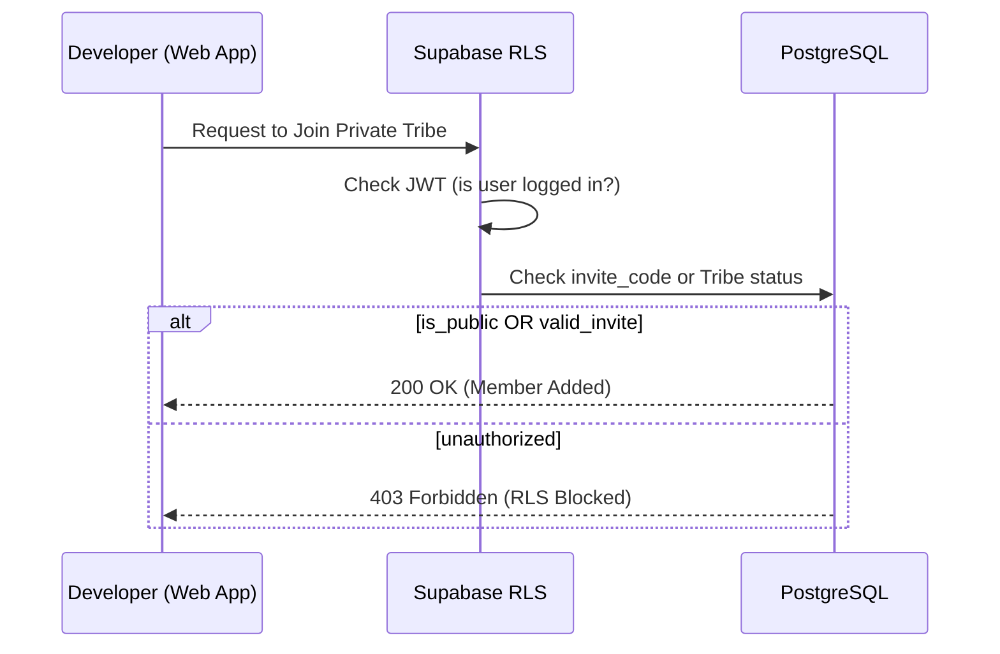

<div align="center">

# 🔷 HashTribe

**A developer-first community and collaboration platform**

[](LICENSE)
[](https://www.typescriptlang.org/)
[](https://reactjs.org/)
[](https://supabase.com/)
[](https://vitejs.dev/)
[](https://tailwindcss.com/)

[Features](#-features) • [Tech Stack](#-tech-stack) • [Getting Started](#-getting-started) • [Contributing](#-contributing) • [Roadmap](#-roadmap)

---

</div>

## 📸 Screenshots

<div align="center">
  
  

  <p><em>HashTribe Dashboard - Your developer community hub</em></p>
</div>

---

## 🎯 About

HashTribe (DevCom) is a **verified developer credibility & collaboration platform** where developers build proof-based profiles, join communities (Tribes), compete in coding challenges, and collaborate on real projects.

### Phase 1 MVP - Tribes System ✅

This initial release focuses on the **Tribes** (community) system with:

- ✅ GitHub OAuth authentication
- ✅ Create & manage Tribes (public/private)
- ✅ Join/leave Tribes
- ✅ Role-based permissions (Admin/Member)
- ✅ Row Level Security (RLS) for data protection
- ✅ Developer profiles linked to GitHub
- 🔜 Topics & Discussions (coming soon)
- 🔜 Competitions & Leaderboards (coming soon)

---

## ✨ Features

### Current (Phase 1)

| Feature | Description |
|---------|-------------|
| 🔐 **Authentication** | GitHub OAuth via Supabase Auth |
| 👥 **Tribes System** | Create and join developer communities |
| 👤 **Profiles** | Auto-generated from GitHub data |
| 🛡️ **Security** | Row Level Security (RLS) policies |
| 📱 **Responsive UI** | Dark theme, developer-centric design |

### Planned (Phase 2 & 3)

See [SCOPE.md](SCOPE.md) for the complete product vision including:
- 💬 Topics & Discussions
- 🏆 Competitions & Events
- 📊 Leaderboards & Rankings
- 🎯 DevCom Score System
- 🏢 Company Accounts
- 🤝 Project Collaboration

---

## 🛠 Tech Stack

### Frontend
- **React 18** - UI library with hooks
- **TypeScript** - Type safety and better DX
- **Vite** - Fast build tool and dev server
- **Tailwind CSS** - Utility-first CSS framework
- **Zustand** - Lightweight state management
- **React Router** - Client-side routing

### Backend
- **Supabase** - Backend as a Service
  - PostgreSQL database with real-time capabilities
  - Authentication (GitHub OAuth)
  - Row Level Security (RLS)
  - Real-time subscriptions

### Development & Tooling
- **pnpm workspaces** - Efficient package management
- **ESLint** - Code linting
- **Prettier** - Code formatting
- **Supabase CLI** - Local development

---

## 🗺️ System Architecture

HashTribe operates as a unified monorepo where the frontend and shared logic are tightly coupled, protected by Supabase's identity-aware security layer.

### 🔷 Monorepo & Data Flow


---

## 🚀 Getting Started

### Prerequisites

- **Node.js** 18+ ([nvm](https://github.com/nvm-sh/nvm) recommended)
- **pnpm** 8+ (`npm install -g pnpm`)
- **Supabase CLI** ([installation guide](https://supabase.com/docs/guides/cli))
- **Git**

### Installation

1. **Clone the repository**
   ```bash
   git clone https://github.com/YOUR_USERNAME/HashTribe.git
   cd HashTribe
   ```

2. **Install dependencies**
   ```bash
   pnpm install
   ```

3. **Start Supabase locally**
   ```bash
   pnpm supabase:start
   ```
   
   This will output your local Supabase credentials:
   ```
   API URL: http://localhost:54321
   anon key: eyJh...
   service_role key: eyJh...
   ```

4. **Configure environment variables**
   ```bash
   cp .env.example .env
   ```
   
   Edit `.env` and add your Supabase credentials:
   ```env
   VITE_SUPABASE_URL=http://localhost:54321
   VITE_SUPABASE_ANON_KEY=your_anon_key_here
   ```

5. **Run database migrations**
   ```bash
   pnpm db:migrate
   ```

6. **Configure GitHub OAuth**
   
   a. Create a GitHub OAuth App:
   - Go to https://github.com/settings/developers
   - Click "New OAuth App"
   - Set **Authorization callback URL**: `http://localhost:54321/auth/v1/callback`
   - Copy the **Client ID** and **Client Secret**
   
   b. Add to Supabase:
   - Open Supabase Studio: http://localhost:54323
   - Go to **Authentication** → **Providers** → **GitHub**
   - Enable GitHub and add your Client ID and Secret
   - Save

7. **Start the development server**
   ```bash
   pnpm dev
   ```
   
   The app will open at http://localhost:5173

### Installation (Using Docker)

### Prerequisites

- **Docker** 20+
- **Docker Compose**

1. **Clone the repository**
```
git clone https://github.com/YOUR_USERNAME/HashTribe.git
cd HashTribe
```

2. **Configure environment variables**

Copy the example env file:
```
cp .env.example .env
```

Edit .env and add your Supabase credentials:
```
VITE_SUPABASE_URL=https://your-project.supabase.co
VITE_SUPABASE_ANON_KEY=your-public-anon-key
```

Only use the anon key, never the service role key in the frontend.

3. **Build and run the project**
```
docker compose up --build
```

- Docker will build the frontend app with your .env keys

- Nginx serves the production-ready app

- Open your browser at:

http://localhost:5173


5. **Optional: GitHub OAuth Setup**

   1. Create a GitHub OAuth App:

   - Go to https://github.com/settings/developers → New OAuth App

   - Set Authorization callback URL: http://localhost:54321/auth/v1/callback

   - Copy Client ID and Client Secret

   2. Add OAuth credentials in Supabase:

   - Open Supabase Studio → Authentication → Providers → GitHub

   - Enable GitHub and add your Client ID & Secret

6. **Access the App**

Once Docker is running, the app will be available at:

http://localhost:5173

### First Login

1. Click "Continue with GitHub"
2. Authorize the application
3. You'll be redirected back and your profile will be auto-created
4. Start creating Tribes!

---

## 📁 Project Structure

This project uses **pnpm workspaces** to share code between the frontend and potential future packages (like a CLI or mobile app).

* **`apps/web`**: The main React application. It handles all UI and user interactions.
* **`packages/shared`**: The single source of truth for TypeScript interfaces and validation logic used by both the frontend and database types.
* **`supabase/`**: Contains the "Backend-as-a-Code." If you want to change how Tribes work, you likely need to edit the SQL migrations here.

```
HashTribe/
├── 📁 apps/
│   └── 📁 web/                 # React frontend
│       ├── 📁 src/
│       │   ├── 📁 components/  # Reusable components
│       │   ├── 📁 pages/       # Page components
│       │   ├── 📁 stores/      # Zustand stores
│       │   ├── 📁 lib/         # Utilities & config
│       │   └── App.tsx         # Main app component
│       └── package.json
├── 📁 packages/
│   └── 📁 shared/              # Shared types & utilities
│       ├── 📁 src/
│       │   ├── 📁 types/       # TypeScript types
│       │   └── 📁 utils/       # Utility functions
│       └── package.json
├── 📁 supabase/
│   ├── 📁 migrations/          # Database migrations
│   ├── seed.sql                # Seed data
│   └── config.toml             # Supabase config
├── .env.example                # Environment template
├── pnpm-workspace.yaml         # Workspace config
└── package.json                # Root package
```

---

## 🧪 Development

### Available Scripts

| Command | Description |
|---------|-------------|
| `pnpm dev` | Start development server |
| `pnpm build` | Build for production |
| `pnpm preview` | Preview production build |
| `pnpm lint` | Run ESLint |
| `pnpm type-check` | Run TypeScript checks |
| `pnpm db:types` | Generate TypeScript types from DB |
| `pnpm db:reset` | Reset local database |
| `pnpm db:migrate` | Run migrations |
| `pnpm supabase:start` | Start local Supabase |
| `pnpm supabase:stop` | Stop local Supabase |

### Database Schema

Key tables:
- `users` - User profiles (linked to auth.users)
- `tribes` - Communities
- `tribe_members` - Membership with roles
- `topics` - Discussion topics (Phase 1)
- `topic_replies` - Replies to topics (Phase 1)
- `competitions` - Coding competitions (Phase 1)
- `competition_participants` - Competition entries (Phase 1)

See `supabase/migrations/` for complete schema and RLS policies.

### 🔐 Join Tribe Logic (Security Flow)
To ensure the integrity of private Tribes, the following flow is enforced by RLS:



---

## 🤝 Contributing

We welcome contributions! HashTribe is built for **ECWoC** (Engineering College Winter of Code) and open-source contributors.

### Quick Start

1. Check [CONTRIBUTING.md](CONTRIBUTING.md) for detailed guidelines
2. Look for issues labeled `good-first-issue`
3. Comment on an issue to get it assigned
4. Fork, code, and submit a PR!

### Issue Labels

| Label | Description |
|-------|-------------|
| `good-first-issue` | Perfect for newcomers |
| `frontend` | React/UI work |
| `backend` | Supabase/Database work |
| `rls` | Row Level Security policies |
| `bug` | Something isn't working |
| `enhancement` | New feature |

---

## 🗺 Roadmap

### ✅ Phase 1 - MVP (Current)
- [x] Project setup & architecture
- [x] GitHub OAuth authentication
- [x] Tribes CRUD with RLS
- [x] Membership management
- [ ] Topics & discussions
- [ ] Basic competitions
- [ ] Leaderboards

### 🔜 Phase 2 - Growth
- [ ] LeetCode/HackerRank integration
- [ ] Company accounts
- [ ] Hiring challenges
- [ ] DevCom Score v2
- [ ] Profile analytics

### 🔮 Phase 3 - Scale
- [ ] AI-powered matching
- [ ] Advanced analytics
- [ ] Recruiter tools
- [ ] Global rankings
- [ ] Mobile app

See [SCOPE.md](SCOPE.md) for the complete product vision.

---

## 📄 License

This project is licensed under the MIT License - see the [LICENSE](LICENSE) file for details.

---

## 🙏 Acknowledgments

- Built for **ECWoC** (Engineering College Winter of Code)
- Powered by [Supabase](https://supabase.com/)
- UI inspired by modern developer tools

---

## 📞 Contact

- **Issues**: [GitHub Issues](https://github.com/YOUR_USERNAME/HashTribe/issues)
- **Discussions**: [GitHub Discussions](https://github.com/YOUR_USERNAME/HashTribe/discussions)

---

<div align="center">

**Built with ❤️ by developers, for developers**

[⭐ Star this repo](https://github.com/YOUR_USERNAME/HashTribe) if you find it useful!

</div>
